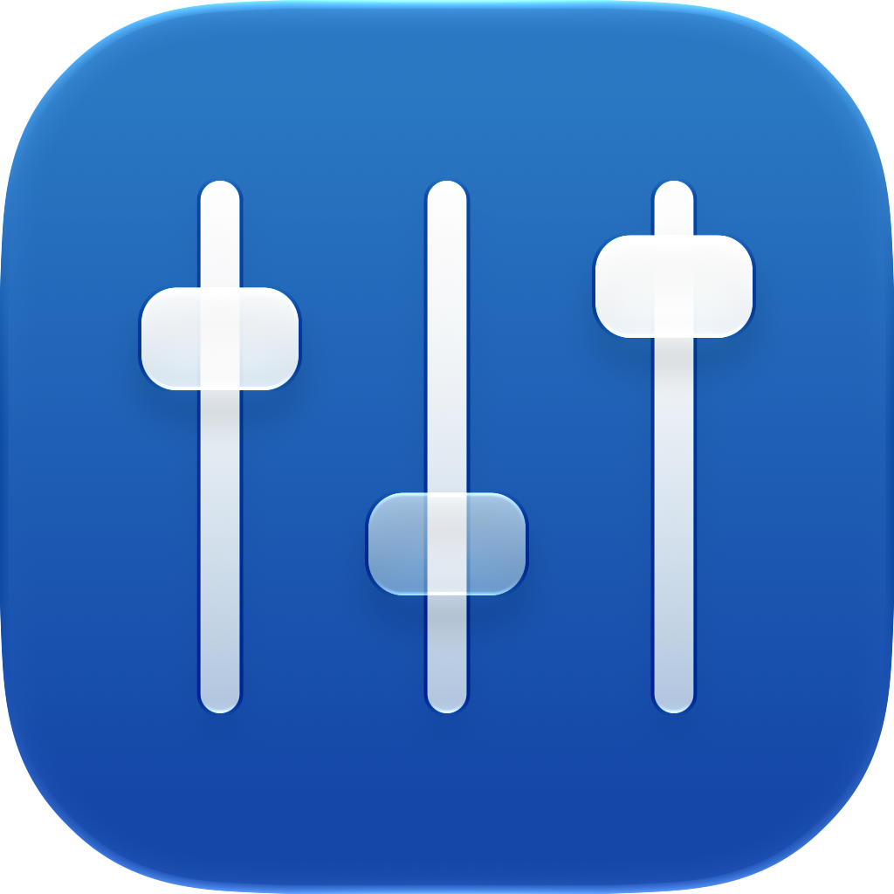

<p align="center"></p>

# Conch

A native macOS menu-bar mixer with independent volume and mute controls for each app.

**Requires macOS 27 or later and an Apple silicon Mac.** Conch is an early release;
app and device compatibility is still being tested. It controls captured app audio,
but **does not prevent FaceTime from ducking other audio**.

## Download and install

1. Open [Releases](https://github.com/mattstaber/Conch/releases) and download
   `Conch-<version>-macOS-arm64.zip` under **Assets**. The source-code archives are
   for developers and do not contain a built app.
2. Unzip it and move **Conch.app** to **Applications**.
3. Open Conch and allow **System Audio Recording** when macOS prompts.
4. Click the speaker in the menu bar. Mixing starts automatically.

Current automated builds are **ad-hoc signed, not notarized**. macOS may block the
first launch. If you trust the release, attempt to open it, then use **System
Settings → Privacy & Security → Open Anyway** if offered. Do not disable Gatekeeper
or SIP. See [Apple's instructions](https://support.apple.com/en-us/102445).

If no release is available yet, [build from source](#build-from-source).
Each release includes a SHA-256 checksum; see the [release guide](docs/Releasing.md)
for verification and signing details.

## Using Conch

- **System volume:** the top slider adjusts the current output device. Its speaker
  icon follows system volume and mute changes. Fixed-volume outputs disable this control.
- **App volume:** play audio in an app to make it appear. Drag its slider or use the
  speaker buttons to change volume in five-percentage-point steps.
- **Mute:** click an app's icon without moving its slider. Dragging to zero also
  shows mute. Raising the slider restores sound unless you separately muted the app.
- **Audio levels:** the slider meter shows activity from the app's captured audio.
  It is not a measurement of physical speaker loudness.
- **App lifetime:** paused apps can remain in the list until they quit. Volume and
  mute reset on the next launch; idle apps are not listed just because they are open.
- **Settings:** choose launch at login, inactive-app visibility, and audio meters.
  Output-device selection stays in macOS Sound Settings.

Quit Conch from the bottom of its panel to stop mixing and restore direct playback.

## Privacy and permissions

Conch processes audio in memory on your Mac. It never saves or transmits captured
audio and has no accounts, analytics, telemetry, or runtime network requests.
System Audio Recording permission is needed for per-app process taps. Conch does
not request microphone, camera, screen-image, or Accessibility access, and installs
no driver or privileged helper.

## Compatibility and limitations

- Safari and the installed YouTube Music web app were verified as separate rows
  during simultaneous playback. QuickTime's production audio callback passed
  measured half-gain, mute, and restore checks. This does not establish compatibility
  with every app, media service, or output device.
- The engine supports one mono/stereo float32 output stream. Unsupported formats,
  multiple outputs, protected content, or unresolved audio services may not work.
- Device changes, sleep, recovery, or quitting may briefly restore an app's original
  volume. Conch mute is not a persistent system-level privacy mute.
- There is no FaceTime ducking override or automatic gain compensation. Microphone
  gain, voice processing, and echo cancellation are not modified.
- App ownership uses an optional, undocumented macOS lookup,
  `responsibility_get_pid_responsible_for_pid`, in the main build. It is dynamically
  resolved and falls back to public metadata when unavailable. Apple may change it;
  App Store acceptance and future compatibility are not guaranteed.

See [validation results](docs/Validation.md) for tested behavior and outstanding
hardware/accessibility checks, and [the feasibility notes](docs/Feasibility.md)
for the FaceTime investigation.

## Build from source

Install Xcode 27 with the macOS 27 SDK and complete its first-run setup. There are
no third-party package dependencies.

```sh
git clone https://github.com/mattstaber/Conch.git
cd Conch
./scripts/test.sh
./scripts/build.sh
open build/Conch.app
```

You can also open `Conch.xcodeproj` and run the **Conch** scheme. The build script
prefers Xcode's native layered icon compilation. A SwiftPM fallback uses the
committed ICNS asset when only compatible Command Line Tools are available.

[Contributing](CONTRIBUTING.md) covers development and tests.
[Releasing](docs/Releasing.md) covers downloadable builds and GitHub Actions.
[Architecture](docs/Architecture.md) describes discovery, routing, and metering.

## License

[MIT](LICENSE) © 2026 Matthew Staber.
