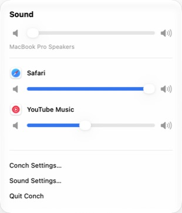

# Conch

A compact native macOS 27 menu-bar mixer. Actual app icons are mute buttons;
native sliders adjust each application's captured audio independently. No visible
percentages, Dock icon, accounts, network access, analytics or dependencies.

**Conch controls app volume; it does not disable FaceTime's system ducking.** Public
voice-processing ducking controls belong to the calling app, and no supported
cross-app override or reliable inverse-gain signal was found in the macOS 27 SDK.
See [the feasibility investigation](docs/Feasibility.md) before relying on Conch for
calls. This is an early functional implementation, not yet a broadly validated
replacement for system audio routing.



## Use

Build, then open `build/Conch.app`. Mixing starts automatically. Click the speaker menu-bar icon.
Allow **System Audio Recording** when macOS asks. The system calls this recording
because audio samples pass through Conch; they are processed in memory, never
written to disk or sent anywhere. No microphone, screen frames, Accessibility
permission, driver, privileged helper or SIP change is required. The main build
uses one optional undocumented process-ownership lookup, described below.

Play audio in an app. It appears once an active output stream is observed, remains
until that launch ends, and disappears after quit. Stream activity does not prove
nonzero sound. Click the app icon to mute without moving the slider; click again
to restore its selected volume. Dragging to zero also shows mute; raising it restores
sound unless the app icon was independently muted. Volume/mute reset on the app's next launch.
The top slider controls actual hardware output volume; fixed-volume devices show
disabled controls. Speaker buttons step by five percentage points. The menu-bar
speaker tracks external volume/mute changes. App slider tracks contain a contrasting
real post-gain meter; native thumbs, keyboard input and accessibility are preserved.
The footer opens Conch Settings, Sound Settings or quits Conch.
Settings provides Launch at Login, inactive-app visibility and meter visibility.
Install in Applications before using Launch at Login (`SMAppService`). Reopen Conch
or use its **Show Mixer** menu command to find the panel again.

## How it works

Core Audio process objects provide audio activity, PID and destination metadata.
NSWorkspace supplies running app names and icons. Direct PID, responsible-process
identity with bounded ancestry, exact Core Audio bundle ID, containing bundle path
and bounded process ancestry group helpers into verified running user-facing apps.
The main build dynamically resolves the undocumented
`responsibility_get_pid_responsible_for_pid` once. This independently implemented
lookup improves launchd-parented WebKit ownership, including Safari web apps.
If absent or invalid, public metadata remains the fallback. Apple may change this
SPI without notice; unknown ownership is omitted, never guessed by bundle prefix.
Unknown/shared system daemons are omitted rather than incorrectly assigned.

Each active app has a private device-specific `CATapDescription`, using
`mutedWhenTapped`, and a private aggregate device clocked by the physical output.
The C realtime callback applies a 0–1 gain with a 5 ms ramp and replays the audio.
Mute supplies zero gain without changing saved volume. A real post-gain peak meter
reads the same samples only when the panel is open and metering is enabled.
The meter cannot measure later macOS ducking or acoustic speaker loudness.

The engine is event-driven. Default device, stream format and lifecycle changes
rebuild mappings while retaining the app's state. Audio callbacks use lock-free
atomics; no allocations, locks, logging or Swift object work occurs there. The
borderless, nonanimated NSPanel uses native NSGlassEffectView; controls use SwiftUI/AppKit, actual app
icons and system colors. The icon source uses Icon Composer 27.

## Build and test

Requirements: macOS 27+, Xcode 27 with the macOS 27 SDK, license/setup completed.
No packages to download. This checkout was built and tested on Apple silicon.

```sh
./scripts/build.sh
open build/Conch.app
./scripts/test.sh
```

Or open `Conch.xcodeproj`, choose the shared **Conch** scheme, then Run/Test. The
project contains a normal application target and hosted Swift Testing target.
`python3 scripts/generate-project.py` regenerates it after adding source files.
The Swift package can also build/test with macOS 27 Command Line Tools. The build
script prefers Xcode (including native layered icons) and falls back to SwiftPM
with the exported icns. Caches and products live in `.build/` and `build/`.

Tests cover mute/volume preservation, bounded gain, helper path boundaries, PID
reuse, meter decay, format rejection and the actual C callback with sanitizer
checks. A hardware test is opt-in; ordinary tests never capture audio.

```sh
python3 scripts/test-tone.py
# Open build/synthetic-tone.wav in QuickTime, play it, and quit Conch first.
./scripts/live-test.sh
```

On this MacBook Pro, the live test passed at 48 kHz stereo: half gain produced
half the measured peak, mute produced zero, and unmute restored half gain.

The live test captures the generated reference through the production `AudioRoute`
and checks full gain, half gain, mute, restored gain and callback progress. It
prints numeric peaks only. [Validation notes](docs/Validation.md) contain the
remaining device, permission, appearance and FaceTime checks. The local
`Tests/browser-tone.html` fixture offers the same reference in a browser.

`./scripts/inspect-audio.sh` prints read-only device/process metadata for debugging;
it does not create taps or capture audio.

Regenerate the application icon with `./scripts/icon.sh` (requires installed Icon
Composer). Xcode uses `Resources/AppIcon.icon`; CLI builds use its exported icns.

## Limits

- **No FaceTime ducking prevention or automatic compensation.** No microphone gain,
  echo cancellation, voice-processing bypass or AirPods input routing changes.
  FaceTime can be controlled only if its streams can be resolved and
  capturable. Actual live-call behavior and voice quality remain unverified.
- The initial engine supports one physical output stream, mono/stereo native
  float32 PCM, with matching tap/output sample rates. Multi-stream/multichannel
  devices and apps using another/multiple outputs show an error and retain direct
  playback. Bluetooth call profiles may change to an unsupported format.
- Some Safari/WebKit helpers, system-owned call services and protected media may
  not resolve to the user-facing app or may not deliver capturable samples.
- Device switching, recovery, sleep and quitting can briefly restore an app's
  original direct level, even when its saved Conch mute is on. Conch mute is not a
  persistent system-wide privacy/security mute.
- A watchdog releases failed/stalled routes; this is not a guarantee of glitch-free
  playback. Low latency, Bluetooth stability and multi-app overhead require longer
  hardware testing. One aggregate per app favors isolation over minimum overhead.
- Only UI preferences are persisted; previous mixer enablement is ignored. Remembering per-app
  volumes across launches is deliberately deferred.

## Distribution and privacy

`SIGNING_IDENTITY='Developer ID Application: …' ./scripts/build.sh` uses an owner's
signing certificate. Without it the build is ad-hoc signed for local use, with the
hardened runtime enabled. Notarization/stapling and fresh-Mac permission testing
must happen before public distribution. No credentials are included. The app is
not configured for the App Store sandbox and does not claim App Store acceptance.

There is no runtime networking or telemetry code. Only UI preferences are stored;
no audio is persisted. The optional tone generator writes **synthetic** test data,
never captured audio. Developer build/test logs contain numeric diagnostics.

See [Architecture](docs/Architecture.md), [Feasibility](docs/Feasibility.md), and
[Validation](docs/Validation.md) for ownership rules, recovery behavior, SDK evidence
and the boundary between automated verification and manual acceptance.
